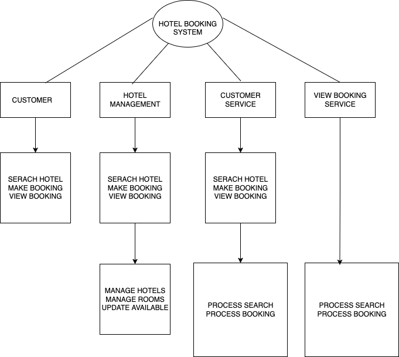

# Requirement Analysis in Software Development.
This project aims to sharpen skills essential for managing and delivering robust software systems by focusing on the cornerstone of successful development: Requirement Analysis.

#What is Requirement Analysis?
Requirement analysis is the disciplined process of discovering, clarifying, structuring, and validating what a system must do and under what conditions, before deciding how to build it. It turns fuzzy ideas into testable, prioritized, and traceable requirements that guide design, development, and testing.

#Why is Requirement Analysis Important?
- Prevents expensive rework: Misunderstood needs discovered late are far costlier to fix than clarifying them early.
- Aligns stakeholders: Establishes a shared, unambiguous understanding of scope, goals, and constraints.
- Guides architecture & design: Non-functional needs (performance, security, scalability) shape technical choices.
- Enables testability: Clear acceptance criteria let QA verify the right behavior.
- Controls scope & change: Prioritization and traceability help manage inevitable changes without chaos.

#Key Activities in Requirement Analysis.
- Requirement Gathering: Requirement gathering is the initial step where the project team collects all possible needs, expectations, and constraints from stakeholders (clients, users, managers, regulators, etc.).
  
- Requirement Elicitation: Elicitation is the process of uncovering the real, underlying needs of stakeholders — not just what they say they want. It involves deeper exploration to distinguish between stated requirements and actual needs.
  
- Requirement Documentation: Requirement documentation is the activity of formally recording all gathered and elicited requirements in a structured, clear, and accessible way.

- Requirement Analysis and Modeling: Analysis and modeling involve studying, refining, and organizing requirements to ensure they are feasible, unambiguous, and aligned with the system’s goals.

- Requirement Validation: Validation is the process of confirming that the documented and analyzed requirements truly reflect stakeholder needs and will lead to the desired outcomes if implemented.

#Types of Requirements
Functional Requirements: 

- Functional requirements: Functional requirements describe what the system should do, the specific behaviors, features, or functions the software must perform. They capture the intended services of the system. (e.g. user roles, authentication, search) 
- Non-functional requirements: This describe how the system should perform (e.g. performance, security, scalability). They are important because they ensure the system meets user expectations in terms of speed, security, and reliability.

#Use Case Diagrams.
A Use Case Diagram is a visual representation of the interactions between users (called actors) and the system. It shows what the system does from the user’s perspective, not how it’s built.

Benefits of Use Case Diagrams;
Clarity for stakeholders: Shows what users can do with the system in simple terms.
Scope definition: Helps define system boundaries (what’s in scope vs out of scope).
Requirement validation: Ensures all user needs are captured.
Communication tool: Bridges technical teams and non-technical stakeholders.
Foundation for design/testing: Each use case can become a test scenario or feature task.

#Acceptance Criteria.
Acceptance Criteria (AC) are the conditions that a software product must satisfy for a requirement (or user story) to be considered complete and accepted by stakeholders. They act as a bridge between requirements and testing, ensuring clarity for developers, testers, and business stakeholders.

Why Acceptance Criteria are Important:
Clarity of Scope; They prevent ambiguity by explicitly defining what “done” means.
Alignment with Stakeholders; Ensure all parties (developers, testers, clients) share the same understanding of a feature.
Test Basis; Provide a foundation for writing test cases and validating functionality.
Avoid Scope Creep; Clearly set boundaries so no extra, unintended functionality is added.
Improved Quality; Reduces the risk of rework, since expectations are defined upfront.
Traceability; Link requirements directly to acceptance tests for verification in SDLC.

Example;
Feature: “As a customer, I want to complete a booking checkout so that I can confirm and pay for my reservation.”

Acceptance Criteria (AC):
The system must display a summary of booking details (room type, dates, price, taxes).
The user must be able to select a payment method (credit card, PayPal, etc.).
The system must validate payment details before processing.
Upon successful payment, the system must generate a confirmation number and send a confirmation email.
If the payment fails, the system must display a clear error message and allow retry.
The checkout must be completed within 10 seconds under normal load.

With these ACs:
Business stakeholders know what to expect.
Developers know exactly what to build.
Testers know exactly what to verify.
